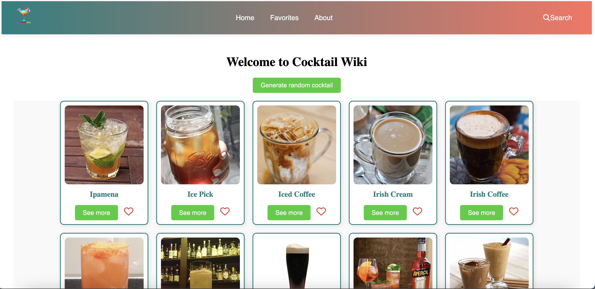
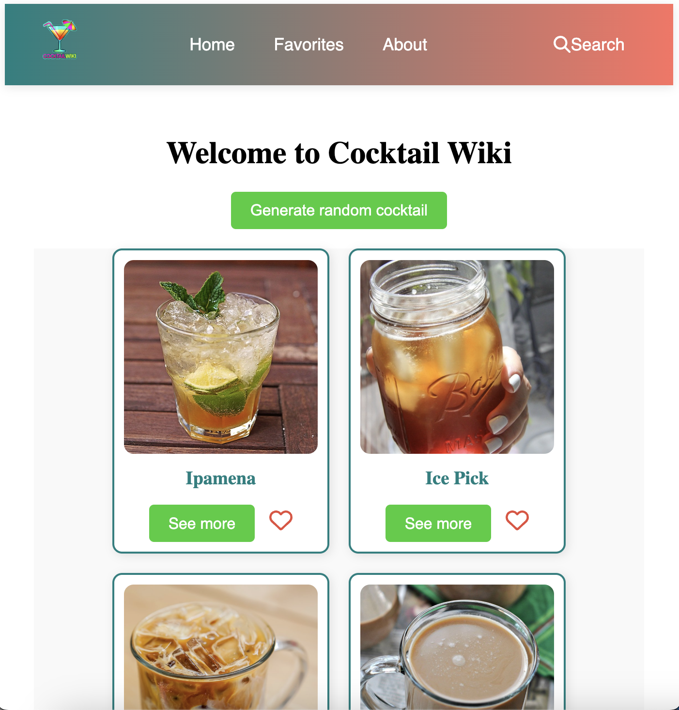

# Cocktail Party 🍸




## Overview

Welcome to **Cocktail Party**, a comprehensive platform where users can search, discover, and save their favorite cocktails. Explore detailed information on various cocktails, ingredients, and more!

## Features

- **Random Cocktail Generator**: Get a randomly selected cocktail with the click of a button.
- **Search Functionality**: Search for cocktails by name, category, ingredient, or glass type.
- **Favorites**: Save your favorite cocktails and view them in a dedicated favorites section.
- **Ingredient Details**: View detailed information on cocktail ingredients, including whether they're alcoholic, their type, ABV, and more.
- **Responsive Design**: Fully responsive and optimized for both desktop and mobile devices.

## Installation

To run this project locally, follow these steps:

1. **Clone the repository**:
   ```bash
   git clone https://github.com/your-username/cocktail-party.git